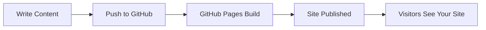

# elipstein.github.io
# 🌟 Welcome to My GitHub Pages Site

> **A showcase of what's possible with GitHub-flavored Markdown**

## About This Project

This repository demonstrates the power and flexibility of GitHub Pages. Whether you're building a personal portfolio, project documentation, or a blog, GitHub Pages makes it easy to create beautiful, responsive websites directly from your repository.

---

## 📋 Table of Contents

- [Features](#features)
- [Getting Started](#getting-started)
- [Markdown Showcase](#markdown-showcase)
- [Code Examples](#code-examples)
- [Media Support](#media-support)
- [Contributing](#contributing)

---

## ✨ Features

- **Free Hosting** - Host your site directly from your GitHub repository
- **Custom Domains** - Use your own domain name
- **Jekyll Support** - Built-in static site generator
- **Markdown Powered** - Write content in simple Markdown
- **Version Control** - Track all changes with Git
- **Responsive Design** - Mobile-friendly out of the box

---

## 🚀 Getting Started

### Prerequisites

```bash
# You'll need Git installed
git --version
```

### Quick Setup

1. **Fork this repository**
2. **Enable GitHub Pages** in repository settings
3. **Choose a theme** (Settings → Pages → Theme Chooser)
4. **Edit content** directly in GitHub or clone locally

```bash
git clone https://github.com/yourusername/your-repo.git
cd your-repo
# Make your changes
git add .
git commit -m "Update content"
git push
```

---

## 📝 Markdown Showcase

### Text Formatting

You can make text **bold**, *italic*, or ***both***. You can also use ~~strikethrough~~ and `inline code`.

### Lists

**Unordered List:**
- First item
- Second item
  - Nested item
  - Another nested item
- Third item

**Ordered List:**
1. First step
2. Second step
3. Third step

### Task Lists

- [x] Set up repository
- [x] Enable GitHub Pages
- [ ] Customize theme
- [ ] Add custom content

### Blockquotes

> "The best way to predict the future is to invent it."
> 
> — Alan Kay

### Tables

| Feature | GitHub Pages | Traditional Hosting |
|---------|-------------|---------------------|
| Cost | Free | Varies |
| Setup Time | Minutes | Hours |
| Version Control | Built-in | Manual |
| SSL/HTTPS | Automatic | Manual setup |

---

## 💻 Code Examples

### JavaScript

```javascript
function greetVisitor(name) {
  const greeting = `Hello, ${name}! Welcome to my GitHub Pages site.`;
  console.log(greeting);
  return greeting;
}

greetVisitor('World');
```

### Python

```python
def calculate_fibonacci(n):
    """Generate Fibonacci sequence up to n terms"""
    fib_sequence = [0, 1]
    for i in range(2, n):
        fib_sequence.append(fib_sequence[-1] + fib_sequence[-2])
    return fib_sequence

print(calculate_fibonacci(10))
```

### CSS

```css
.hero-section {
  background: linear-gradient(135deg, #667eea 0%, #764ba2 100%);
  padding: 4rem 2rem;
  text-align: center;
  color: white;
}

.hero-section h1 {
  font-size: 3rem;
  margin-bottom: 1rem;
}
```

---

## 🎨 Media Support

### Images

You can embed images using Markdown:

```markdown

```


### Badges


### Emojis

GitHub supports emoji! 🎉 ✨ 🚀 💡 📚 🎨 ⚡ 🔥

Just use `:emoji_name:` syntax: `:rocket:` becomes 🚀

---

## 🔗 Links and References

- [GitHub Pages Documentation](https://docs.github.com/pages)
- [Markdown Guide](https://www.markdownguide.org/)
- [Jekyll Themes](https://jekyllrb.com/docs/themes/)
- [GitHub Flavored Markdown Spec](https://github.github.com/gfm/)

---

## 📊 Diagrams with Mermaid



---

## 🌈 Collapsible Sections

<details>
<summary>Click to expand - Advanced Tips</summary>

### Custom Domain Setup

1. Purchase a domain from a registrar
2. Add a `CNAME` file to your repository
3. Configure DNS settings with your registrar
4. Enable HTTPS in GitHub Pages settings

### Using Jekyll Locally

```bash
gem install bundler jekyll
jekyll new my-site
cd my-site
bundle exec jekyll serve
```

</details>

---

## 🤝 Contributing

Contributions are welcome! Here's how you can help:

1. 🍴 Fork the repository
2. 🌿 Create a feature branch (`git checkout -b feature/AmazingFeature`)
3. 💾 Commit your changes (`git commit -m 'Add some AmazingFeature'`)
4. 📤 Push to the branch (`git push origin feature/AmazingFeature`)
5. 🎉 Open a Pull Request

---

## 📄 License

This project is licensed under the MIT License - see the [LICENSE](LICENSE) file for details.

---

## 📬 Contact

**Your Name** - [@yourtwitter](https://twitter.com/yourtwitter)

Project Link: [https://github.com/yourusername/your-repo](https://github.com/yourusername/your-repo)

---

<div align="center">

### ⭐ Star this repo if you find it helpful!

Made with ❤️ using GitHub Pages


</div>
